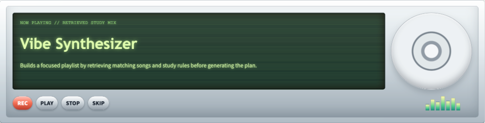
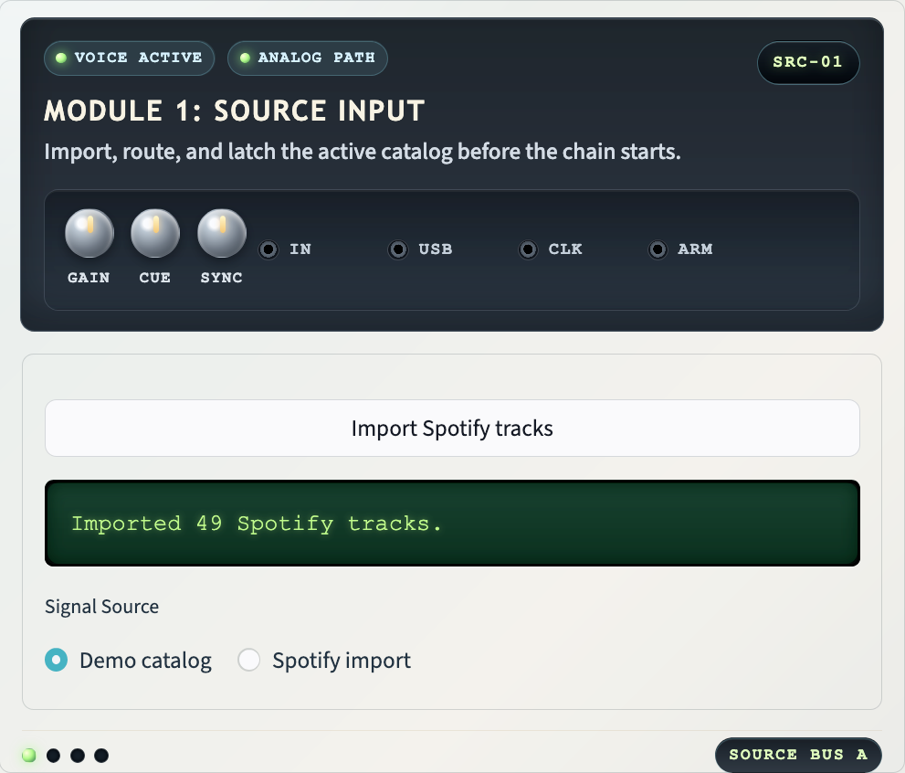
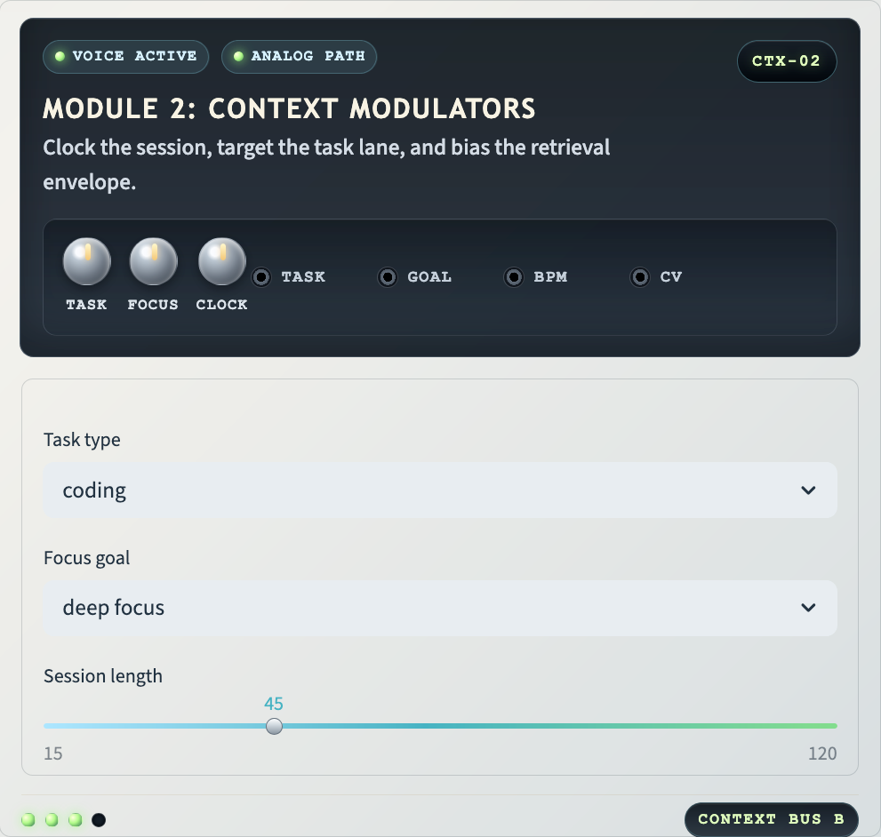
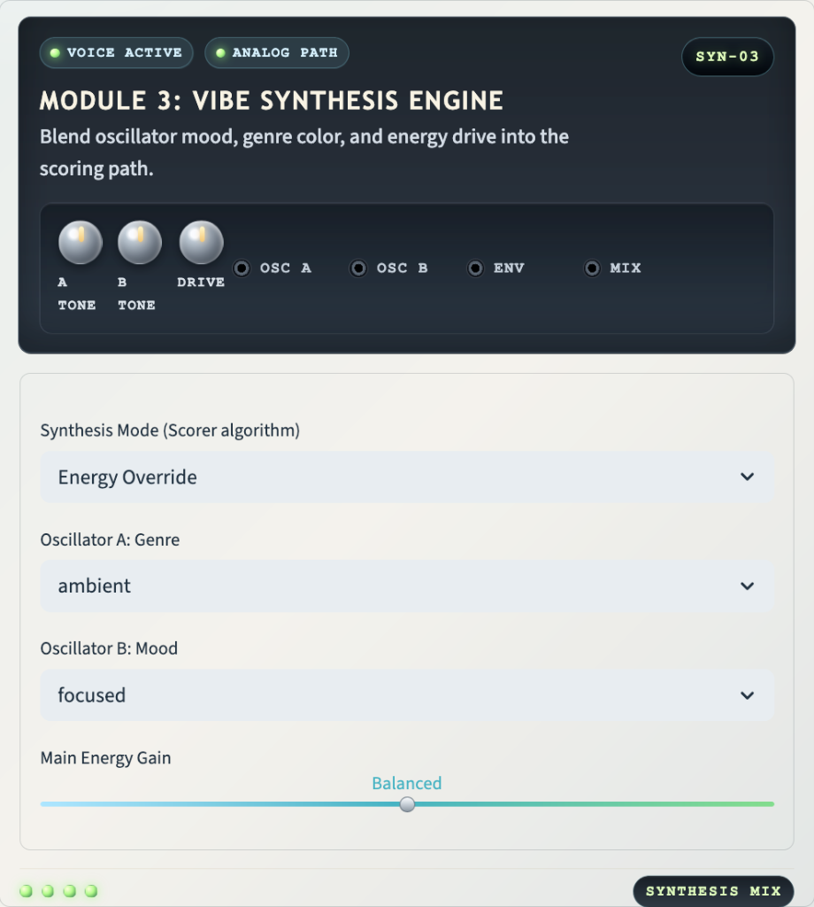
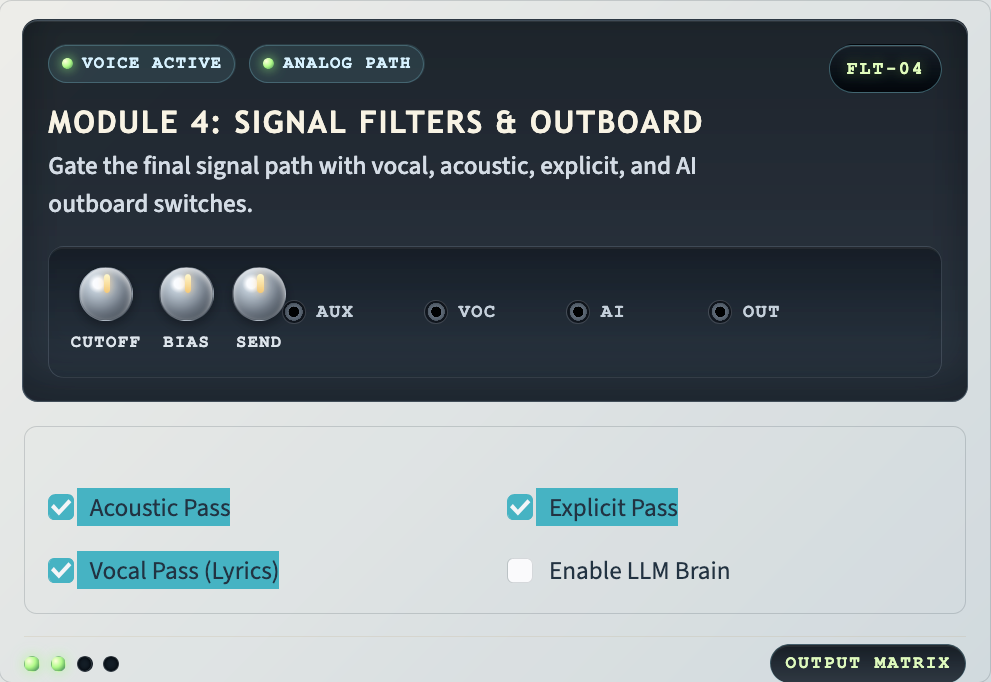
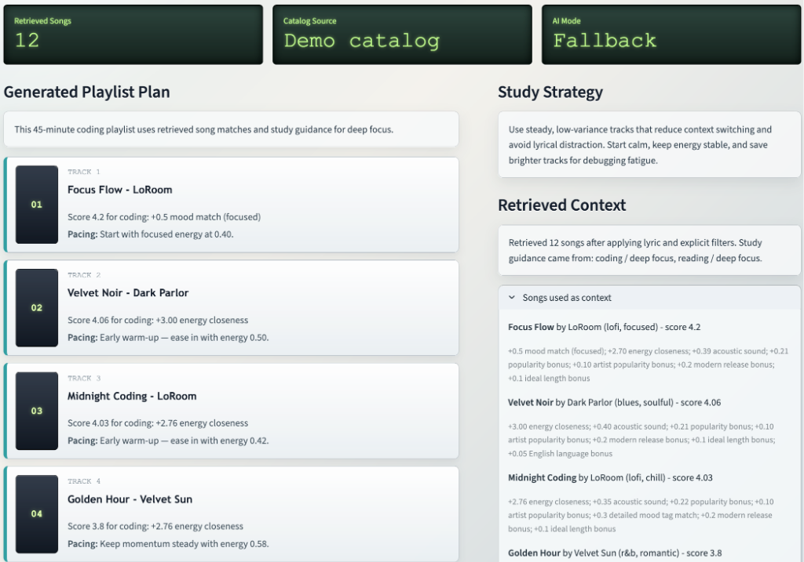

# Vibe Synthesizer (RAG Study DJ)

**Vibe Synthesizer** is an advanced, RAG-powered music recommendation system designed to curate perfectly paced study playlists. By bridging the gap between your personal Spotify library and task-specific cognitive focus strategies, it ensures your audio environment matches the intensity of your work.

## Video Demonstration
Watch the system in action: [Vibe Synthesizer Walkthrough](https://www.loom.com/share/4a1dc9bf68ee40c088fd34eba68d4116)

---

## Original Project: Music Recommender Simulation (Module 3)
This project originated as **Music Recommender Simulation**, a simple command-line interface tool. 
*   **Original Goals**: To demonstrate basic content-based filtering by matching user-inputted genre and mood preferences against a static catalog of 20 songs.
*   **Original Capabilities**: Basic scoring logic based on energy closeness and string-match genre detection, producing a ranked list of top 5 recommendations in the terminal.

---

## Architecture Overview

The Vibe Synthesizer is built on a multi-layered Retrieval-Augmented Generation (RAG) architecture that ensures recommendations are grounded in both user library data and cognitive study principles. 

For a detailed visual map of the data flow and component relationships, see the [System Architecture Diagram](assets/system_diagram.md).


### Core Pipeline
1. **Ingestion**: Music data is pulled from a demo catalog or a live **Spotify account** (using secure PKCE authorization). Spotify tracks are automatically classified for genre and energy using an AI-heuristic hybrid.
2. **Retrieval (RAG)**: The system performs a dual-retrieval step, pulling task-specific guidance from a **knowledge base of study rules** and ranking candidate songs using one of five pluggable scoring strategies.
3. **Synthesis**: An LLM (OpenAI) or deterministic fallback generator synthesizes the retrieved rules and tracks into a cohesive **Playlist Plan**. A "hallucination guard" validates that the final output only contains tracks from the retrieved context.
4. **Presentation**: The final plan, including study strategies and pacing notes, is delivered through a custom **skeuomorphic hardware interface** that provides full transparency into the retrieval process.

### Hardware Interface Modules

| | |
| :---: | :---: |
|  |  |
|  |  |

---

## Setup Instructions

### Prerequisites
- Python 3.8+
- [Spotify Developer Account](https://developer.spotify.com/dashboard/) (to obtain a Client ID)
- (Optional) [OpenAI](https://platform.openai.com/) or [MistralAI](https://console.mistral.ai/) API Key for AI-powered planning.

### Installation
1. **Clone and Enter**:
   ```bash
   git clone https://github.com/shimshiam/ai-system-application-project.git
   cd ai-system-application-project
   ```
2. **Environment Setup**:
   ```bash
   python3 -m venv .venv
   source .venv/bin/activate
   pip install -r requirements.txt
   ```
3. **Configuration**: Create a `.env` file or export the following:
   ```bash
   export SPOTIPY_CLIENT_ID="your_client_id"
   export SPOTIPY_REDIRECT_URI="http://127.0.0.1:8501"
   export OPENAI_API_KEY="your_openai_key"   # Optional
   export MISTRAL_API_KEY="your_mistral_key" # Optional
   ```

### Running the App
```bash
streamlit run streamlit_app.py
```

---

## Sample Interactions

| Input (Task/Goal) | Preferred Vibe | Resulting AI Output (Strategy) |
| :--- | :--- | :--- |
| **Coding / Deep Focus** | Ambient, Focused, Balanced Energy | "Warm-up with 'Spacewalk Thoughts' (0.28 energy). Build to 'Night Drive Loop' (0.75 energy) during core logic hours. Strategy: Use steady rhythms to reduce context switching." |
| **Reading / Deep Focus** | Classical, Peaceful, Chill Energy | "A 30-minute block of peaceful classical music. Strategy: Maintain a spacious soundscape so language processing remains available for text." |
| **Writing / Creative Flow** | Jazz, Relaxed, Balanced Energy | "Mid-energy jazz tracks. Strategy: Support creative momentum with warm, organic sounds that don't overpower language-heavy work." |



---

## Design Decisions & Trade-offs

*   **Skeuomorphic Hardware UI**: I chose a "Mix Console" aesthetic to make the "Synthesis" of vibes feel physical and tactile, moving away from flat modern design to create a more focused, nostalgic environment.
*   **Spotify PKCE Authorization**: I implemented the PKCE flow specifically to improve security. This allows the application to run in client-side contexts without requiring a `Client Secret`, making it safer for users to connect their accounts.
*   **RAG vs. Pure Generative**: Instead of letting the AI "hallucinate" songs, I use RAG to ground every recommendation in the user's actual Spotify library or a curated catalog.

---

## Testing Summary

**Reliability Metric**: 18 out of 18 automated tests passed. The system maintains high fidelity by using a "Hallucination Guard" that rejects any AI-generated tracks not found in the initial retrieval context.

*   **Automated Testing**: A suite of 18 `pytest` cases validates the core logic, including:
    *   **Scoring Accuracy**: Ensuring the `Balanced` and `Resonance` scorers rank tracks correctly based on task energy.
    *   **Data Integrity**: Verifying that Spotify ingestion handles missing metadata and strict filter rules (explicit/lyrics) without crashing.
    *   **Grounding**: Confirming that the final playlist plan only includes tracks present in the retrieved context.
*   **Human-in-the-Loop**: The skeuomorphic dashboard provides full transparency. Users can see the "Retrieved Context" (raw scores and reasons) and the "AI Strategy" side-by-side to verify the synthesizer's decisions.
*   **Defensive Design**: If the AI provider (OpenAI/Mistral) is unavailable or produces malformed JSON, the system automatically triggers a **Deterministic Fallback** to ensure the user always receives a valid, well-paced playlist.

### Reliability Report
You can run a comprehensive fidelity check on the recommendation engine by executing:
```bash
python3 scripts/reliability_test.py
```
This script validates the "Hallucination Guard" and measures the average vibe-match score across multiple predefined study scenarios.

---

---

## Reflection: AI and Problem Solving

Building the **Vibe Synthesizer** taught me that the "Vibe" of an AI application is as much about the **deterministic constraints** as it is about the **generative model**. By using RAG, I ensure the AI acts as a "curator" rather than a "creator," which is essential for tools meant to aid human productivity. I learned that the most difficult part of AI development isn't the prompt engineering—it's the **data plumbing** and ensuring the UI provides enough feedback for the user to trust the algorithm's decisions.
