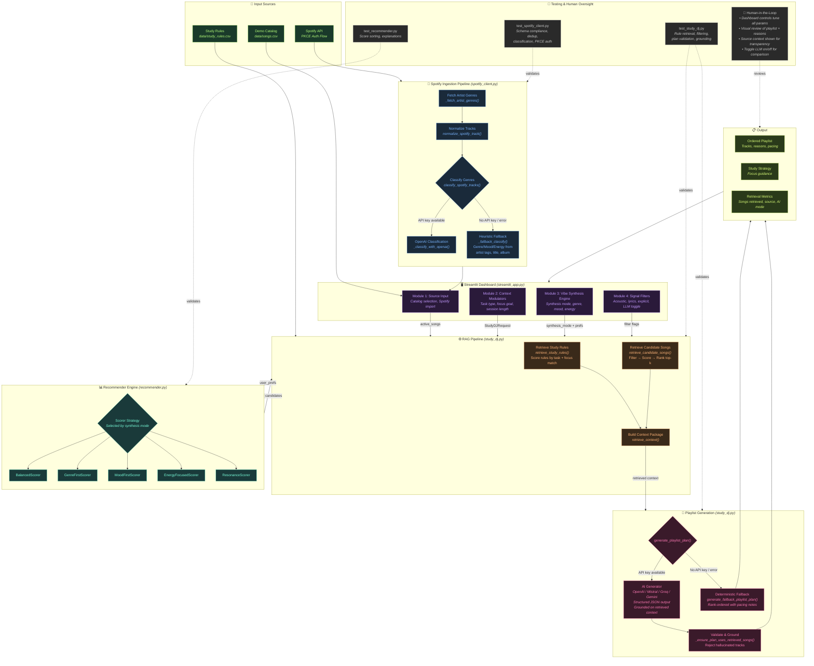

# Study DJ — System Architecture Diagram



## Component Summary

| Component | File(s) | Role |
|-----------|---------|------|
| **Streamlit Dashboard** | `streamlit_app.py` | UI layer — 4 hardware-themed modules let the user configure every parameter |
| **Spotify Ingestion** | `src/spotify_client.py` | Authenticates via PKCE, imports tracks, classifies genre/mood/energy |
| **RAG Retriever** | `src/study_dj.py` | Retrieves matching study rules + candidate songs using scored ranking |
| **Recommender Engine** | `src/recommender.py` | 5 pluggable scorer strategies that rank songs against user preferences |
| **Playlist Generator** | `src/study_dj.py` | AI-grounded (OpenAI/Mistral) or deterministic fallback plan with hallucination guard |
| **Reliability Suite** | `scripts/reliability_test.py` | Automated fidelity and grounding checks across predefined scenarios |
| **Test Suite** | `tests/test_*.py` | 18 automated tests covering scoring, Spotify integration, and RAG grounding |
| **Human Oversight** | Dashboard UI | All retrieval context is visible; users tune params and toggle AI on/off |

## Data Flow Summary

```
User Preferences (UI)
        │
        ▼
┌─────────────────────┐     ┌──────────────────┐
│  Song Catalog        │     │  Study Rules      │
│  (Demo or Spotify)   │     │  (CSV knowledge)  │
└────────┬────────────┘     └────────┬─────────┘
         │                           │
         ▼                           ▼
┌─────────────────────────────────────────────┐
│         RETRIEVAL (RAG)                      │
│  1. Score rules by task/focus match          │
│  2. Filter songs (explicit, lyrics)          │
│  3. Score songs with selected Scorer         │
│  4. Return top-k candidates + rules          │
└────────────────┬────────────────────────────┘
                 │
                 ▼
┌─────────────────────────────────────────────┐
│         GENERATION                           │
│  • AI (OpenAI/Mistral): structured JSON      │
│  • Fallback: deterministic rank + pacing     │
│  • Grounding: reject hallucinated tracks     │
└────────────────┬────────────────────────────┘
                 │
                 ▼
┌─────────────────────────────────────────────┐
│         OUTPUT                               │
│  • Ordered playlist with reasons             │
│  • Study strategy guidance                   │
│  • Full retrieval context (transparent)      │
└─────────────────────────────────────────────┘
```
